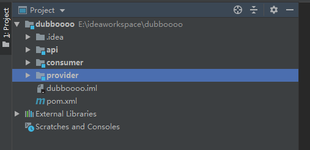

dubbo的介绍大家自行百度，下面以一个demo作为dubbo学习的开始

----------

# DUBBO 入门例子 - 一个服务一个实现
dubbo版本2.5.8  
注册中心使用zookeeper，版本3.4

代码结构如下


**api**是接口服务定义
**consumer**是服务消费者
**provider**是服务生产者

**api**代码如下

```
public interface DemoService {

    String sayHi(String name);
}
```
只是用来定义服务接口，代码很简单

**provider**代码如下
接口实现类
```
public class ProviderService implements DemoService {

    @Override
    public String sayHi(String name) {

        return "provider " + name;
    }
}
```
启动类
```
public class Provider {

    public static void main(String[] args) throws Exception {

        ClassPathXmlApplicationContext context = new ClassPathXmlApplicationContext(new String[]{"provider.xml"});
        context.start();
        System.in.read();
    }
}
```
provider.xml文件内容如下

```
<?xml version="1.0" encoding="UTF-8"?>
<beans xmlns="http://www.springframework.org/schema/beans"
       xmlns:xsi="http://www.w3.org/2001/XMLSchema-instance"
       xmlns:dubbo="http://code.alibabatech.com/schema/dubbo"
       xsi:schemaLocation="http://www.springframework.org/schema/beans
        http://www.springframework.org/schema/beans/spring-beans-4.3.xsd
        http://code.alibabatech.com/schema/dubbo
        http://code.alibabatech.com/schema/dubbo/dubbo.xsd">

    <!-- 提供方应用信息，用于计算依赖关系 -->
    <dubbo:application name="hello-world-app"  />

    <!-- 使用zookeeper注册中心暴露服务地址 -->
    <dubbo:registry address="zookeeper://127.0.0.1:2181" />

    <!-- 用dubbo协议在20880端口暴露服务 -->
    <dubbo:protocol name="dubbo" port="20880" />

    <!-- 声明需要暴露的服务接口 -->
    <dubbo:service interface="com.tiger.dubbo.api.DemoService" ref="demoService" />

    <!-- 和本地bean一样实现服务 -->
    <bean id="demoService" class="com.tiger.dubbo.provider.ProviderService" />
</beans>
```
pom文件如下，consumer类似
```
<?xml version="1.0" encoding="UTF-8"?>
<project xmlns="http://maven.apache.org/POM/4.0.0"
         xmlns:xsi="http://www.w3.org/2001/XMLSchema-instance"
         xsi:schemaLocation="http://maven.apache.org/POM/4.0.0 http://maven.apache.org/xsd/maven-4.0.0.xsd">
    <parent>
        <artifactId>dubboooo</artifactId>
        <groupId>tiger</groupId>
        <version>1.0-SNAPSHOT</version>
    </parent>
    <modelVersion>4.0.0</modelVersion>

    <artifactId>provider</artifactId>

    <dependencies>
        <!-- https://mvnrepository.com/artifact/org.apache.dubbo/dubbo -->
        <dependency>
            <groupId>com.alibaba</groupId>
            <artifactId>dubbo</artifactId>
            <version>2.5.8</version>
        </dependency>

        <dependency>
            <groupId>com.101tec</groupId>
            <artifactId>zkclient</artifactId>
            <version>0.10</version>
        </dependency>
        <dependency>
            <groupId>tiger</groupId>
            <artifactId>api</artifactId>
            <version>1.0-SNAPSHOT</version>
        </dependency>
    </dependencies>
</project>
```
**consumer**代码如下
```
public class Consumer {

    public static void main(String[] args) {

        ClassPathXmlApplicationContext context = new ClassPathXmlApplicationContext(new String[]{"consumer.xml"});
        context.start();
        DemoService service = (DemoService) context.getBean("demoService");
        System.out.println(service.sayHi("wawa"));
    }
}
```
consumer.xml配置文件如下
```
<?xml version="1.0" encoding="UTF-8"?>
<beans xmlns="http://www.springframework.org/schema/beans"
       xmlns:xsi="http://www.w3.org/2001/XMLSchema-instance"
       xmlns:dubbo="http://code.alibabatech.com/schema/dubbo"
       xsi:schemaLocation="http://www.springframework.org/schema/beans
        http://www.springframework.org/schema/beans/spring-beans-4.3.xsd
        http://code.alibabatech.com/schema/dubbo
        http://code.alibabatech.com/schema/dubbo/dubbo.xsd">

    <!-- 消费方应用名，用于计算依赖关系，不是匹配条件，不要与提供方一样 -->
    <dubbo:application name="consumer-of-helloworld-app"  />

    <!-- 使用zookeeper注册中心暴露服务地址 -->
    <dubbo:registry address="zookeeper://127.0.0.1:2181" />

    <!-- 生成远程服务代理，可以和本地bean一样使用demoService -->
    <dubbo:reference id="demoService" interface="com.tiger.dubbo.api.DemoService" />
</beans>
```

依次启动zookeeper、provider、consumer，consumer控制台显示“provider wawa”则成功。

# 例子 - 一个服务多个实现
以上是dubbo最简单的demo，下面在demo的基础上做一些简答的修改。